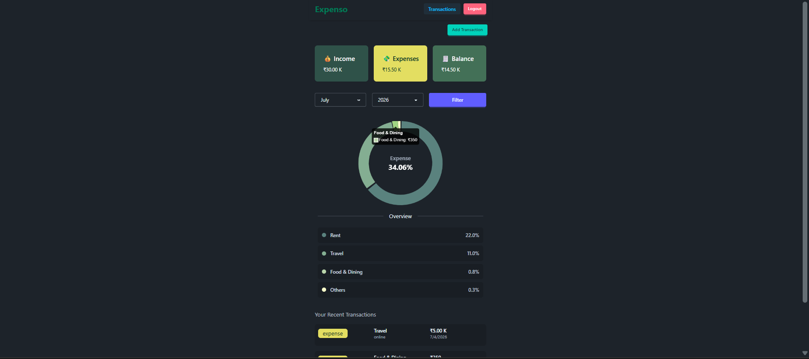

# 💰 Expense Tracker

A full-stack **MERN Expense Tracker** built using **React.js, Node.js, Express.js, and MongoDB** that helps users efficiently manage their personal finances. The application allows users to securely track income and expenses, visualize spending patterns through charts, and manage transactions with an intuitive and responsive interface.



---

## 🚀 Live Demo

🔗 **Live Demo:** https://mern-expense-tracker-five.vercel.app/

📂 **GitHub Repository:** https://github.com/keerthana0403/mern-expense-tracker

---

# ✨ Features

## 🔐 Authentication

- Email & Password Authentication
- Google Sign-In
- Guest Login
- JWT Authentication
- Protected Routes

## 💰 Expense Management

- Add Income & Expense Records
- Edit Existing Transactions
- Delete Transactions
- Categorize Income & Expenses
- Real-time Dashboard Updates

## 📊 Dashboard & Analytics

- Monthly Income & Expense Summary
- Category-wise Expense Chart
- Financial Overview Dashboard
- Interactive Data Visualization

## 📋 Transaction History

- View Complete Transaction History
- Filter Transactions by Date
- Separate Transaction Management Page

## 📱 User Experience

- Responsive Design
- Fast State Management
- Clean & Modern UI
- Secure API Communication

---

# 🛠️ Tech Stack

### Frontend

- React.js
- Vite
- Context API
- Zustand
- Axios
- CSS

### Backend

- Node.js
- Express.js
- JWT Authentication
- REST API

### Database

- MongoDB
- Mongoose

### Authentication

- JWT
- Google OAuth
- Email & Password Login
- Guest Login

---

# 📂 Project Structure

```text
expense-tracker/
├── backend/
│   ├── controllers/
│   │   ├── auth.controller.js
│   │   └── expense.controller.js
│   ├── db/
│   │   └── connectToMongoDB.js
│   ├── middleware/
│   │   └── protectRoute.js
│   ├── models/
│   │   ├── expense.model.js
│   │   └── user.model.js
│   ├── routes/
│   │   ├── auth.routes.js
│   │   └── expense.routes.js
│   ├── utils/
│   │   └── generateToken.js
│   ├── package.json
│   └── server.js
│
├── frontend/
│   ├── public/
│   ├── src/
│   │   ├── api/
│   │   ├── assets/
│   │   ├── components/
│   │   ├── constants/
│   │   ├── context/
│   │   ├── hooks/
│   │   ├── pages/
│   │   ├── zustand/
│   │   ├── App.jsx
│   │   ├── main.jsx
│   │   └── index.css
│   ├── package.json
│   ├── vite.config.js
│   └── vercel.json
```

---

# ⚙️ Installation

## Clone the repository

```bash
git clone https://github.com/keerthana0403/mern-expense-tracker.git
```

```bash
cd expense-tracker
```

---

## Install Backend Dependencies

```bash
cd backend
npm install
```

---

## Install Frontend Dependencies

```bash
cd ../frontend
npm install
```

---

# 🔑 Environment Variables

## Backend (.env)

```env
PORT=5000
MONGO_DB_URI=your_mongodb_connection_string
JWT_TOKEN=your_jwt_secret
NODE_ENV=development
FRONTEND_URL=http://localhost:5173
```

## Frontend (.env)

```env
VITE_GOOGLE_CLIENT_ID=your_google_client_id
VITE_API_BASE_URL=http://localhost:5000/api
```

---

# ▶️ Running the Application

### Start Backend

```bash
cd backend
npm run dev
```

### Start Frontend

```bash
cd frontend
npm run dev
```

Frontend:

```
http://localhost:5173
```

Backend:

```
http://localhost:5000
```

---

# 🔒 Authentication Flow

- User registers using Email & Password.
- Existing users can log in securely.
- Google OAuth authentication is supported.
- Guest Login allows users to explore the application instantly.
- JWT tokens are used to protect private routes and APIs.

---

# 📊 Application Workflow

```text
User Authentication
        │
        ▼
Dashboard
        │
        ├── Add Income
        ├── Add Expense
        ├── Edit Transaction
        ├── Delete Transaction
        ├── Monthly Summary
        └── Expense Analytics
                    │
                    ▼
         Transaction History
                    │
                    ▼
           Date-wise Filtering
```

---

# 🚀 Future Improvements

- Budget Planning
- Recurring Transactions
- Export Transactions (PDF/Excel)
- Multi-Currency Support
- Dark Mode
- Email Notifications
- Spending Insights
- AI-powered Expense Analysis

---

# 💡 Key Highlights

- 🔐 Secure JWT Authentication
- 🔑 Google OAuth Integration
- 👤 Guest Login
- 📊 Category-wise Expense Analytics
- 📅 Monthly Expense Tracking
- 📈 Interactive Dashboard
- ⚡ Context API + Zustand State Management
- 📱 Responsive UI
- 🚀 RESTful API Architecture

---

# 👨‍💻 Author

**Keerthana E**

- GitHub: https://github.com/keerthana0403
- LinkedIn: https://www.linkedin.com/in/keerthana-e-a3055a1b5/

---

## ⭐ Show your support

If you found this project useful, please consider giving it a **⭐ Star** on GitHub.
